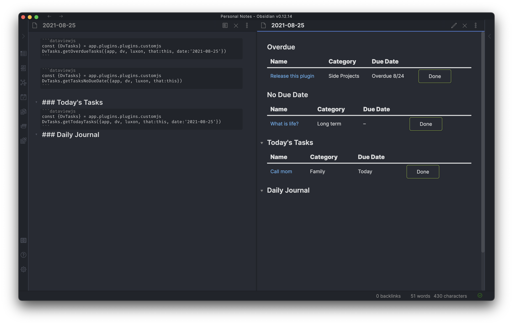

# CustomJS

CustomJS is a plugin for Obsidian that allows users to write custom Javascript that you can call anywhere you can write JS — including `dataviewjs` blocks and templater templates.

✅ Works on desktop and mobile!

## Installation

#### Recommended
CustomJS is available in the Obsidian community plugin browser.

#### Manual
Go to the [releases](https://github.com/samlewis0602/obsidian-custom-js/releases) and download the latest `main.js` and `manifest.json` files. Create a folder called `customjs` inside `.obsidian/plugins` and place both files in it.

## Settings
Tell CustomJS what code to load.

**Individual files**: A comma-separated list of files you'd like to load.

**Folder**: Path to a folder that contains JS files you'd like to load.

*Note: the folder setting will load all `*.js` files in that folder **recursively**. So setting `scripts` will load `scripts/a.js` and `scripts/other/b.js`*

⚠️ Files are loaded in alphabetical order for consistency, enabling dependencies on each other.

## Usage/Example

CustomJS works by writing javascript classes. Each file can only contain one class.

````
// in vault at scripts/coolString.js
class CoolString {
    coolify(s) {
        return `😎 ${s} 😎`
    }
}


// dataviewjs block in *.md
```dataviewjs
const {CoolString} = customJS
dv.list(dv.pages().file.name.map(n => CoolString.coolify(n)))
```
````

Make sure you add `scripts/coolString.js` to the settings page for CustomJS and voila! When entering preview mode for the dataviewjs block you should see a list of all your files with a little extra 😎

## Advanced example
You can pass anything as parameters to your functions to allow for some incredible code reuse. A dataview example that I use to manage tasks:

#### Daily note
````
```dataviewjs
const {DvTasks} = customJS
DvTasks.getOverdueTasks({app, dv, luxon, that:this, date:'2021-08-25'})
```

```dataviewjs
const {DvTasks} = customJS
DvTasks.getTasksNoDueDate({app, dv, luxon, that:this})
```

### Today's Tasks
```dataviewjs
const {DvTasks} = customJS
DvTasks.getTodayTasks({app, dv, luxon, that:this, date:'2021-08-25'}) 
```
### Daily Journal
````

#### scripts/dvTasks.js
```
class DvTasks {
  relDateString(d, luxon) {
    if (!(d instanceof luxon.DateTime)) return '–'
    const now = luxon.DateTime.now()
    const days = Math.ceil(d.diff(now, 'days').days)
    if (days < 0) return 'Overdue ' + d.toFormat('L/d')
    if (days === 0) return 'Today'
    if (days === 1) return 'Tomorrow'
    if (days < 7) return d.toFormat('cccc')
    return d.toFormat('ccc L/d')
  }

  getButtonStrings(status) {
    const completed = status === 'Completed'
    const btnStr = completed ? 'Undo' : 'Done'
    const updateStr = completed ? 'To-Do' : 'Completed'
    return { btnStr, updateStr }
  }

  getCustomLink(name, target) {
    return `[[${target}|${name}]]`
  }

  getTodayTasks(args) {
    const { luxon, dv, date, that } = args
    const finalDate = date ?? dv.current().file.name
    return this.getTasksTable({
      ...args,
      filterFn: t => t.status != 'Completed' && t.dueDate && t.dueDate?.hasSame(luxon.DateTime.fromISO(finalDate), 'day')
    })
  }

  getOverdueTasks(args) {
    const { luxon, dv, date, that } = args
    const finalDate = date ?? dv.current().file.name
    return this.getTasksTable({
      ...args,
      prependText: 'Overdue',
      filterFn: t => t.dueDate && t.dueDate < luxon.DateTime.fromISO(finalDate) && t.status != 'Completed'
    })
  }

  getTasksNoDueDate(args) {
    return this.getTasksTable({
      ...args,
      prependText: 'No Due Date',
      filterFn: t => !t.dueDate
    })
  }

  getTasksTable(args) {
    const {
      that,
      app,
      dv,
      luxon,
      getSortProp = t => t.dueDate,
      sortOrder = 'asc',
      filterFn = t => t.task,
      completedCol = false,
      prependHeaderLevel = 3,
      prependText
    } = args;
    const { metaedit, buttons } = app.plugins.plugins
    const { update } = metaedit.api
    const { createButton } = buttons


    const dueStr = completedCol ? 'Completed' : 'Due Date';
    const pages = dv.pages("#task").sort(getSortProp, sortOrder).where(filterFn)
    if (pages.length === 0) {
      // console.log('Empty dataview:', args)
      return
    }

    if (prependText) {
      dv.header(prependHeaderLevel, prependText)
    }

    dv.table(["Name", "Category", dueStr, "", ""], pages
      .map(t => {
        const { btnStr, updateStr } = this.getButtonStrings(t.status)
        return [
          this.getCustomLink(t.task, t.file.name),
          t.category,
          this.relDateString(t.dueDate, luxon),
          createButton({
            app,
            el: that.container,
            args: { name: btnStr },
            clickOverride: { click: update, params: ['Status', updateStr, t.file.path] }
          }),
        ]
      })
    )
  }
}
```

#### Result


## ☕️ Support
Do you find CustomJS useful? Consider buying me a coffee to fuel updates and more useful software like this. Thank you!

<a href="https://www.buymeacoffee.com/samlewis" target="_blank"></a>
